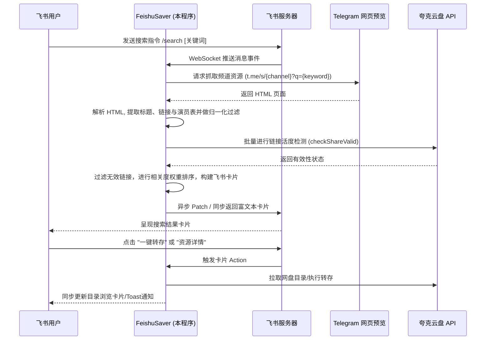

# FeishuSaver (飞书云盘转存助手)

`FeishuSaver` 是一个基于飞书机器人的智能云盘资源检索与一键转存服务。**本项目二次开发自原开源项目 [FeishuSaver](https://github.com/jiangrui1994/FeishuSaver)**，在此基础上进行了彻底的架构重构与深度精简：去除了所有的前端 Web 页面和外部 Express API 路由，转型为**纯粹的、面向飞书机器人长连接（WebSocket）的独立后端服务**，不依赖任何公网 IP 或反向代理。

---

## 🚀 项目定位与核心优势

1. **零公网 IP 依赖**：基于飞书 Lark SDK 的 **WebSocket 长连接（Event Trigger）** 方式启动。机器人本地直接与飞书服务器建立长连接并双向通信，**无需公网 IP、无需域名、无需内网穿透或反向代理 Nginx**，只要有网即可在一秒内上线运行。
2. **多网盘复合提取**：当采集到的 Telegram 资源贴中混合了百度网盘、UC网盘、迅雷和夸克网盘等多种链接时，系统会自动穿透并将其中可用的**夸克网盘链接**提取并标记出来，完美支持多网盘复合资源。
3. **极佳的 AI Agent 友好性**：项目结构高度模块化（TypeScript + InversifyJS 依赖注入 + SQLite 本地存储）。这种设计使得项目对 **AI 编码助手（如 Google Antigravity 等 AI Agent）** 极其友好，便于 AI 自动化理解架构、编写新服务并进行自愈调试。

---

## 📸 运行效果截图展示

为了直观呈现 `FeishuSaver` 在飞书客户端的交互效果，以下是核心功能的运行截图：

| 🔍 资源搜索结果展示 (`/search`) | 🎯 交互式转存路径选择 (`/transfer`) |
|:---:|:---:|
|  |  |

| ⚙️ 对话框配置面板 (`/config`) | 🎬 发现好片推荐 (`/hot`) |
|:---:|:---:|
|  |  |

---

## 📖 机器人功能菜单

在飞书客户端与机器人对话时，支持发送以下指令或执行以下交互动作：

* **🔍 资源搜索 (`/search <关键词>`)**：
  * 支持多词联合检索（用空格分隔），进行 `AND` 条件强校验。
  * 自动剔除剧情简介，仅匹配标题、译名、演员表及分类标签，并自动过滤失效死链。
  * 支持中点、空格等字符归一化匹配，并将标题匹配项置顶。
* **⚙️ 系统配置 (`/config`)**：
  * 在飞书对话框直接拉起配置面板。
  * 支持交互式配置夸克网盘 Cookie、查看网盘账号信息及当前网盘剩余容量。
  * 支持实时管理（增删）Telegram 订阅源频道列表，并自动回写持久化。
* **🎬 发现好片 (`/hot` 或点击推荐)**：
  * 拉起豆瓣热门电影/剧集榜单卡片，提供 12 个细分分类按钮（如热门电影、国产剧集、热门美剧等）。
  * 点击任意分类可实时获取豆瓣最新评分榜单，支持在卡片上直接点击进行资源搜索和分页切换。
* **💾 一键转存 (`/transfer-quark <分享ID>`)**：
  * 在搜索卡片上直接点击“一键转存”按钮，或发送指令，可拉起转存目录选择器。
  * 支持交互式逐层进入云盘目录、确定保存路径，完成秒级转存。

---

## 🌟 核心功能特性

### 🔍 1. 精准影视元数据检索 (`/search`)
* **多词联合检索**：支持以空格分隔的多个关键词组合检索（如 `/search 天龙八部 胡军`），检索采用 `AND` 逻辑强匹配。
* **限定元数据范围**：系统会自动将报文解构，**仅在标题、副标题（译名）和演员表/导演表中进行匹配**，彻底规避了匹配剧情简介中无关字词导致的污染。
* **匹配归一化**：匹配时自动剔除英文字符点、中文中点（`•`、`·`）、空格、短横线等分隔符，不论搜索 `金凯瑞` 还是 `金•凯瑞` 都能精准命中。
* **智能相关度排序**：标题完全命中的资源会强制置顶，描述中匹配演员的资源排在后方作为补充。
* **动态片段摘要**：如果关键词命中在演员表中，飞书消息卡片会自动定位并截取其前后 75 个字符作为上下文高亮摘要。

### ⚡ 2. 在线链接活度检测
* 在渲染搜索结果前，系统会调用云盘官方接口对所有提取出的分享 ID（`pwdId`）进行**实时在线有效性检测**。自动过滤已被官方封禁、和谐或过期的死链，确保用户在飞书客户端里看到的全部是 100% 可用的活链。

### 📁 3. 飞书卡片式目录转存 (`/transfer`)
* 用户点击“一键转存”后，机器人会在对话中同步推送当前网盘的目录树。用户可以直接在飞书卡片上通过按钮逐层浏览目录，并选择具体的目标文件夹进行一键保存，转存状态实时回传。

### 🛠️ 4. 聊天框直写配置中心 (`/config`)
* 无需登录任何网页后台。直接在飞书对话框发送 `/config`，机器人会推送交互式卡片，您可直接在飞书里修改/更新：
  * 夸克网盘 Cookie
  * 夸克网盘账号与容量监控
  * Telegram 抓取频道列表（支持在线增删）
  * 输入后，系统会自动将配置回写至本地 `.env` 配置文件并同步至 SQLite。

---

## 🛠️ 技术栈

* **核心框架**：Node.js + TypeScript
* **依赖注入**：InversifyJS
* **飞书开发**：Lark Suite Node SDK (WebSocket 模式)
* **网络与爬虫**：Axios + Cheerio (Telegram 频道静态页面解析，无需代理凭证)
* **数据库**：SQLite 3 + Sequelize ORM (存储用户设置、缓存和会话状态)
* **单元测试**：Jest + ts-jest
* **进程管理**：PM2

---

## 📐 系统原理与工作流



---

## 📦 部署与开发运行

我们提供了交互式引导部署脚本 `deploy.sh`。只需准备好飞书应用的 App ID 和 App Secret，即可进入引导程序。

### 0. 查看部署脚本帮助
您可以使用以下命令查看部署向导的参数与模式说明：
```bash
./deploy.sh --help
```

### 1. ⚡ 一键极速部署 (推荐)
直接在服务器终端运行以下一条命令即可！该命令会自动下载代码、安装依赖、完成编译并通过 PM2 守护运行：
```bash
bash <(curl -sL https://raw.githubusercontent.com/Level6me/FeishuSaver/main/install.sh)
```
*(如果已经克隆了代码到本地，也可以直接执行 `chmod +x deploy.sh && ./deploy.sh`)*

### 2. 🛠️ 手动部署与指令控制
如果您希望手动控制依赖安装与编译，执行 `./deploy.sh` 并在模式中选择 `2`。脚本会帮您自动生成/覆写根目录的 `.env` 配置文件，随后您可以手动运行以下命令：
```bash
# 1. 安装项目所有依赖
npm install && npm run install:backend

# 2. 编译 TypeScript 代码
npm run build

# 3. 通过 PM2 启动服务
pm2 start ecosystem.config.js
```

### 3. 服务日常维护指令
* **查看服务状态**：`pm2 status`
* **查看实时运行日志**：`pm2 logs feishusaver-bot`
* **重启服务进程**：`pm2 restart feishusaver-bot`

---

## ⚖️ 开源协议

本项目采用 [MIT License](LICENSE) 许可协议。
